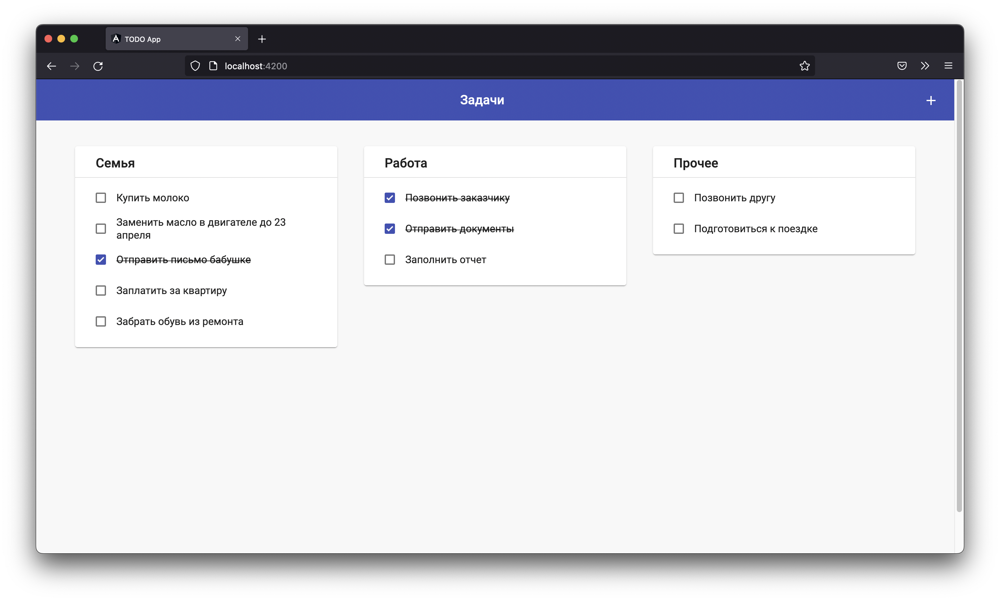

# Frontend part of TODO Angular app

## Overview

This is the frontend part of the TODO application in Angular

The backend part is made using Rails and can be found [in this repository](https://github.com/ksnitsky/Rails-TODO-api)

## The main goal

The application must include:
- Display task lists by category
- Ability to create a new task
- Task status switching

Also:
- Using the latest version of Angular to implement the framework and application logic
- Angular Material UI for layout
- Task creation form using Reactive forms
- Working with classes using class-transformer 

### Screenshot

## Built with

- [Angular 13.3.1](https://angular.io/)
- [Angular Material UI](https://material.angular.io/)
- [Express JS](https://expressjs.com/) for Heroku deployment
- [Class-Transformer](https://github.com/typestack/class-transformer)
- [My API](https://github.com/ksnitsky/Rails-TODO-api)
- [Reactive Forms](https://angular.io/guide/reactive-forms)
